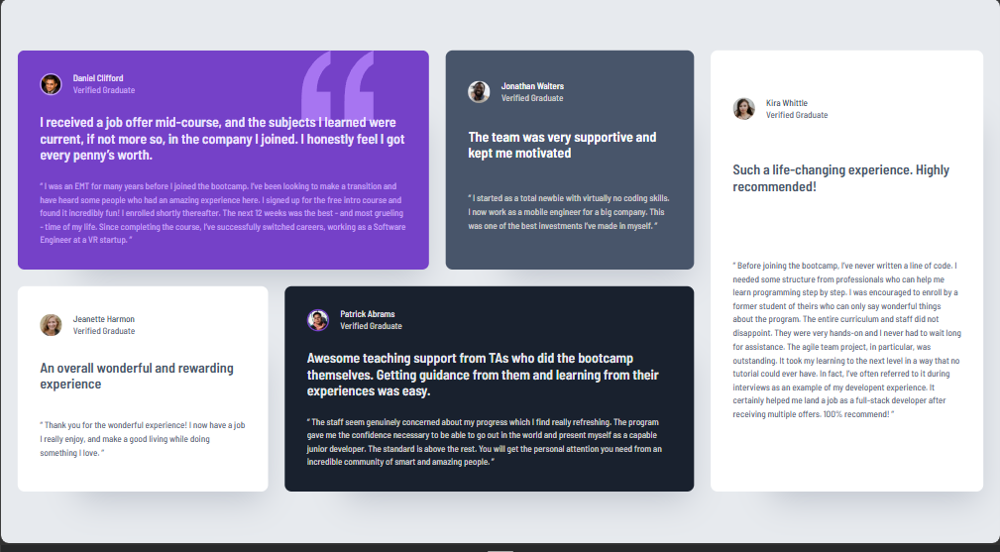

# Frontend Mentor - Testimonials Grid Section Solution
 
This is my solution to the [Testimonials Grid Section challenge on Frontend Mentor](https://www.frontendmentor.io/challenges/testimonials-grid-section-Nnw6J7Un7).
 
This project focused on building a responsive testimonial layout using semantic HTML, CSS Grid, Flexbox, reusable CSS custom properties, and a mobile-first workflow.
 
## Table of Contents
 
- #overview
- #the-challenge
- #screenshot
- #links
- #my-process
- #built-with
- #what-i-learned
- #continued-development
- #ai-collaboration
- #author
 
## Overview
 
### The Challenge
 
Users should be able to:
 
- View the optimal layout depending on their device's screen size
- See the testimonial cards arranged in a single-column layout on smaller screens
- See the testimonial cards arranged in a multi-column CSS Grid layout on larger screens
 
### Screenshot
 
.
 


### Links
 
- Solution URL: [Add Frontend Mentor solution URL here]
- Live Site URL: https://qcyrus8j562z1111.github.io/testimonials-grid-section/
 
## My Process
 
### Built With
 
- Semantic HTML5
- CSS custom properties
- CSS logical properties
- Flexbox
- CSS Grid
- Mobile-first workflow
- Responsive media queries
- Reusable spacing and color design tokens
 
### What I Learned
 
One of the biggest lessons from this project was understanding when to use Grid and when to use Flexbox.
 
Flexbox worked well for the smaller one-dimensional profile layout:
 
```css
.profile {
display: flex;
align-items: center;
gap: var(--space-sm);
}
```
 
CSS Grid handled the overall testimonial layout because the desktop design required control over both rows and columns.
 
```css
.testimonials-grid {
display: grid;
gap: var(--space-md);
}
```
 
At the desktop breakpoint, I changed the layout into four columns:
 
```css
@media (min-width: 75rem) {
.testimonials-grid {
grid-template-columns: repeat(4, 1fr);
max-width: 69.5rem;
margin-inline: auto;
padding-inline: 0;
}
}
```
 
I also learned how individual Grid items can span multiple columns and rows.
 
For example, Daniel's testimonial spans two columns:
 
```css
.testimonial-daniel {
grid-column: 1 / 3;
grid-row: 1;
}
```
 
Kira's testimonial occupies one column but spans both rows:
 
```css
.testimonial-kira {
grid-column: 4;
grid-row: 1 / 3;
}
```
 
Another important lesson was separating shared styles from card-specific styles. The `.testimonial` class handles styling shared by every card, while classes such as `.testimonial-daniel` handle only the differences between individual cards.
 
I also carried feedback from a previous project into this solution by using CSS logical properties and reusable custom properties.
 
```css
:root {
--space-sm: 1rem;
--space-md: 1.5rem;
--space-lg: 2rem;
--radius-card: 0.625rem;
}
```
 
Instead of repeating values throughout the stylesheet, these variables make the design system easier to understand and maintain.
 
### Continued Development
 
I want to continue improving my understanding of CSS Grid, especially grid placement, responsive layouts, and deciding when Grid or Flexbox is the better tool.
 
I also want to continue improving how I structure CSS before writing it. This project reinforced the value of separating:
 
- Shared component styles
- Component-specific styles
- Mobile-first base styles
- Desktop-specific layout styles
 
I plan to continue using meaningful Git commits throughout future projects instead of waiting until the project is finished to commit everything at once.
 
I also want to continue applying feedback from previous projects to new ones, particularly around CSS logical properties, reusable design tokens, responsive design, and maintainable CSS.
 
### AI Collaboration
 
I used Microsoft Copilot as a learning and development assistant throughout this project.
 
Rather than using AI to generate the finished project, I used it primarily to help me reason through the development process. This included:
 
- Reviewing semantic HTML structure
- Understanding reusable CSS classes
- Debugging selector and class-name issues
- Understanding the difference between Grid and Flexbox
- Learning how Grid items span rows and column[Add live site URL here]s
- Comparing my implementation with the supplied reference designs
- Reviewing responsive behavior at different viewport widths
- Applying feedback from previous projects
- Maintaining a professional Git workflow with meaningful commits
 
An important part of the process was working through problems myself before relying on a finished answer. There were frustrating moments, especially when debugging CSS selectors and responsive layout behavior, but working through those problems helped reinforce the concepts.
 
AI was most useful when it explained why something worked or failed instead of simply providing replacement code.
 
## Author
 
- GitHub - [@qcyrus8j562z1111](https://github.com/qcyrus8j562z1111)
- Frontend Mentor - https://www.frontendmentor.io/profile/qcyrus8j562z1111
